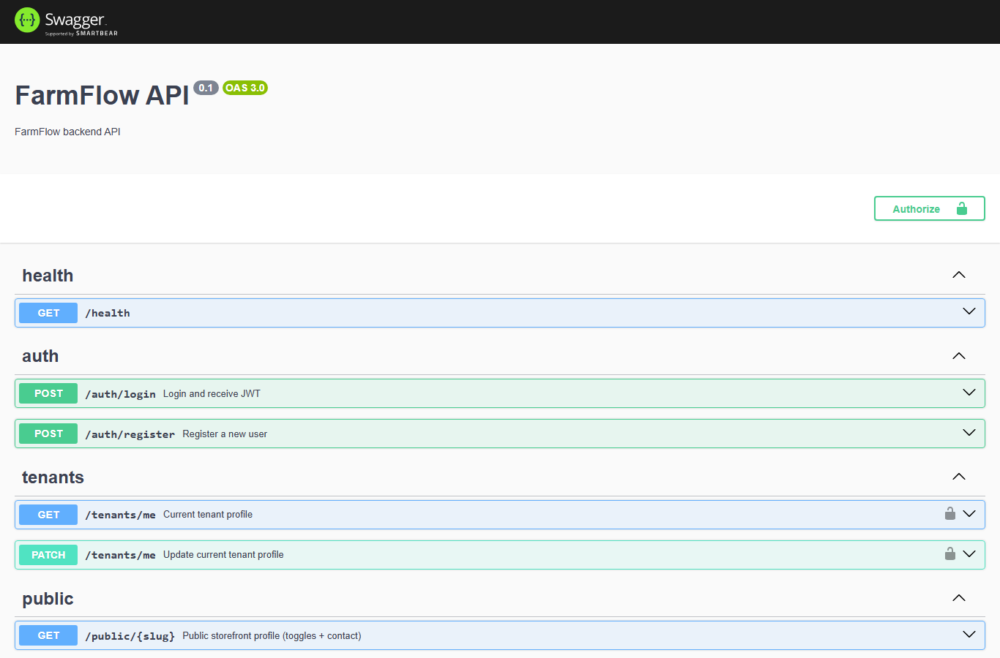
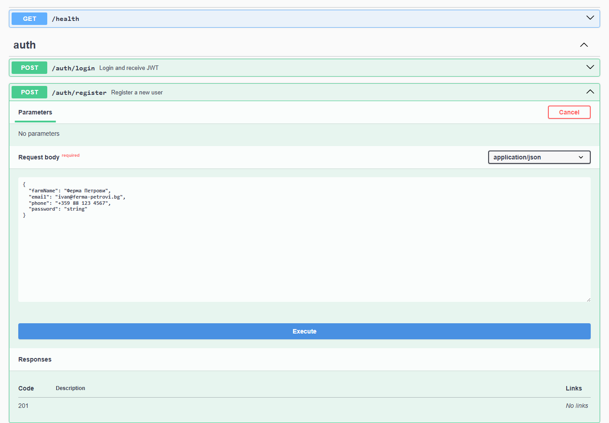
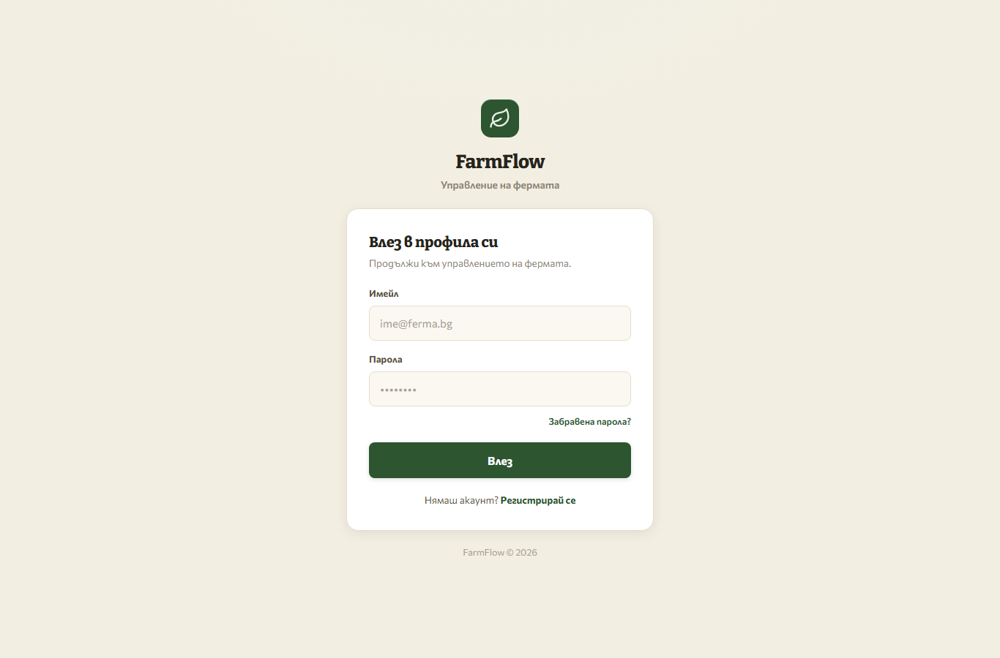
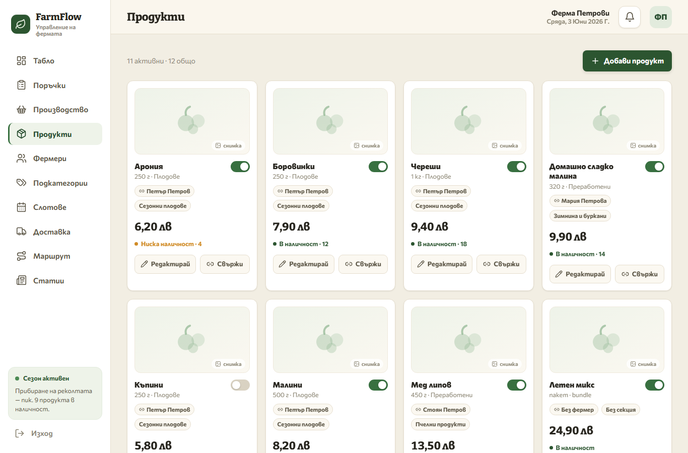
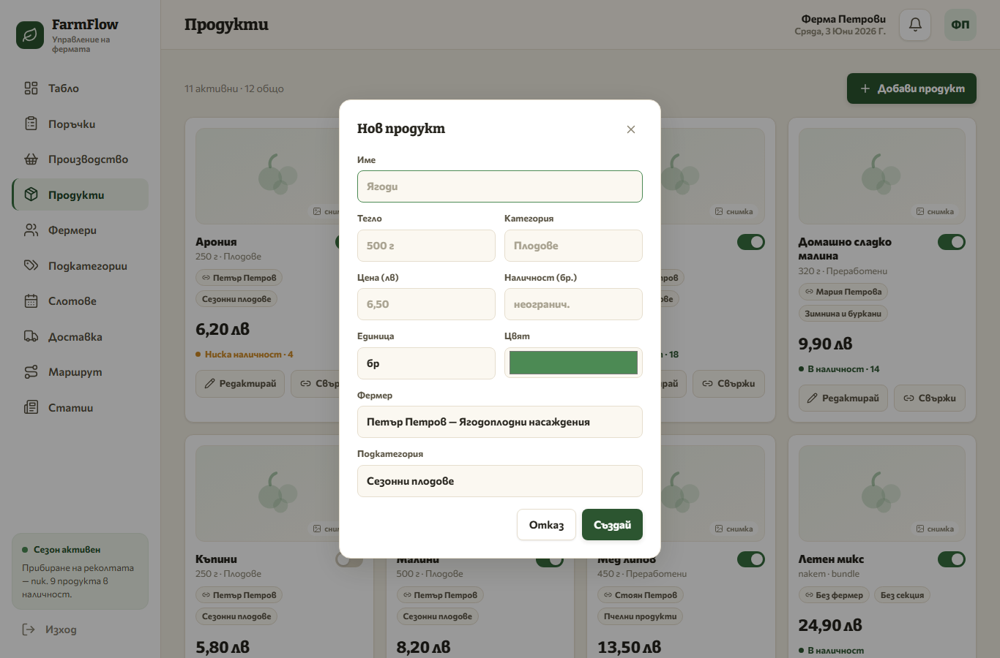
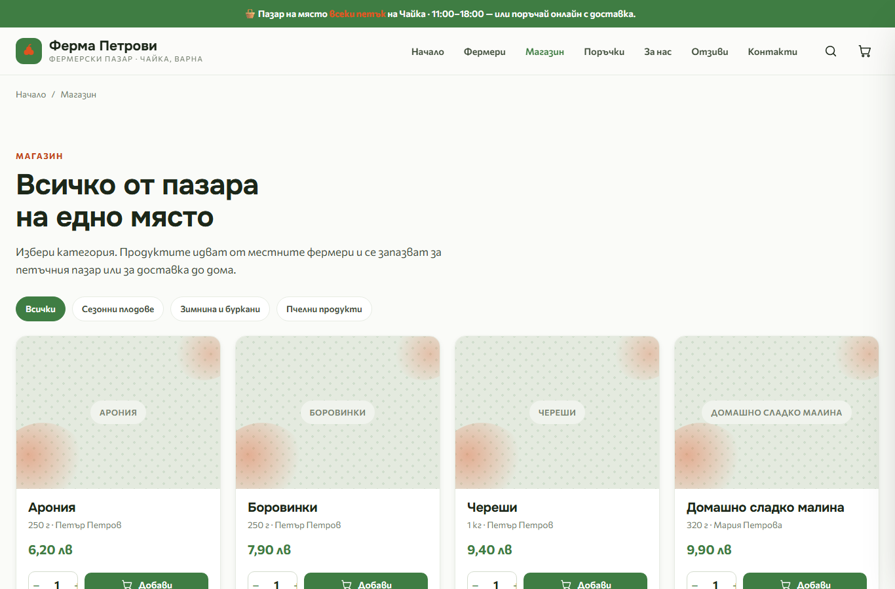
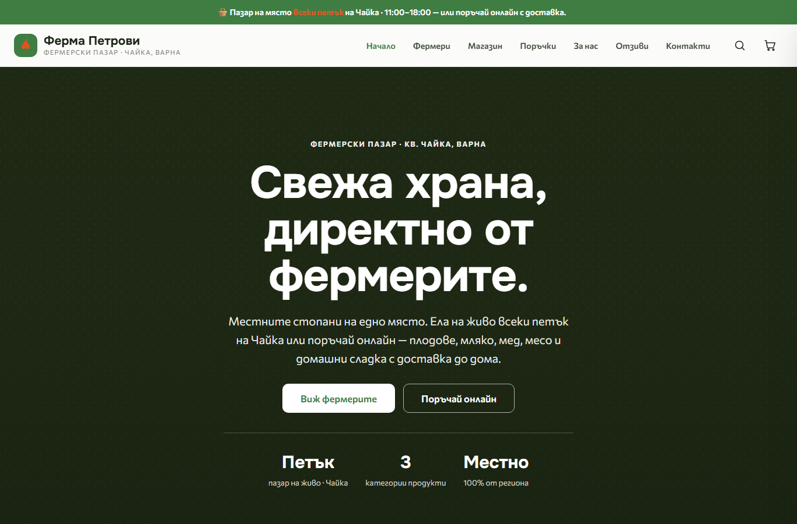

# Adding a new third‑party storefront (new farm/tenant)

This guide walks you through adding a **new website** to FarmFlow — from creating
its tenant, to filling its catalog from the admin panel, to pointing a storefront
at it. Every farm is an isolated **tenant**; one API + one database serve all of
them, and each storefront shows only its own tenant's data.

> **TL;DR**
> 1. Create a tenant (`POST /auth/register`) → you get a login + a `slug`.
> 2. Log into the admin, add products / farmers / categories.
> 3. Deploy a storefront with `PUBLIC_TENANT_SLUG=<that slug>`.
> 4. Done — the site renders that tenant's catalog.

---

## How the pieces connect

```
                       ┌──────────────────────────────┐
   Admin panel  ──────▶│  FarmFlow API (NestJS)        │──▶  Postgres
   (per owner)         │  POST /products /farmers ...  │     (one DB,
   localhost:3005      │  GET  /public/:slug/...       │      tenant‑scoped)
                       └──────────────────────────────┘
                                     ▲
   Storefront A (slug = ferma-petrovi)  ─┐
   Storefront B (slug = site-two)        ├─ GET /public/:slug/products …
   Storefront C (slug = site-three)      ─┘   (CORS‑open, no auth)
```

* **Isolation is enforced in the API**, not the UI. Every write/read is scoped to
  the `tenantId` carried in the admin's JWT, so tenant A can never see or edit
  tenant B's data.
* The storefront reads the **public, CORS‑open** endpoints (`/public/:slug/...`),
  picking the tenant by `slug`.

### Ports (this deployment)

| Service | URL | Notes |
| --- | --- | --- |
| API (NestJS) | `http://localhost:3000` | `PORT` env. Swagger at `/docs`. |
| Admin panel (`client`) | `http://localhost:3005` | `next start -p 3005` |
| Storefront (Astro) | `http://localhost:3004` | `server.port` in `astro.config.mjs` / env |
| Postgres | `localhost:5433` | `docker compose up` in the FarmFlow repo |
| Redis | `localhost:6379` | cache |

> Source defaults differ (API 3001, admin 3002, storefront 3003). The numbers above
> are what the running stack actually uses — adjust to your environment.

---

## Prerequisites

Make sure the backend is up and seeded before adding anything:

```bash
# in the FarmFlow repo
docker compose up -d            # postgres + redis
pnpm --filter @farmflow/db migrate
pnpm --filter @farmflow/db seed # optional demo tenant "ferma-petrovi"
pnpm --filter @farmflow/server dev   # API on :3000
pnpm --filter @farmflow/client dev   # admin on :3005 (or next start -p 3005)
```

Confirm the API is live: open **http://localhost:3000/docs**.



---

## Step 1 — Create the tenant

A tenant + its owner (admin) user are created in one call. Two ways:

### Option A — Swagger (no tools needed)

1. Open **http://localhost:3000/docs**.
2. Expand **auth → `POST /auth/register`**, click **Try it out**.
3. Fill the body and **Execute**:



```json
{
  "farmName": "Ферма Петрови",
  "email": "owner@new-farm.bg",
  "phone": "+359 88 123 4567",
  "password": "change-me-123"
}
```

* `farmName` (min 2 chars) becomes the tenant **name**, and a unique **slug** is
  derived from it (e.g. `Ферма Петрови` → `ferma-petrovi`; collisions get a
  numeric suffix).
* `password` min 6 chars.
* The response is `{ "accessToken": "<JWT>" }` — that token already represents the
  new tenant (the admin panel will get its own when the owner logs in).

### Option B — curl

```bash
curl -s http://localhost:3000/auth/register \
  -H 'content-type: application/json' \
  -d '{"farmName":"New Farm","email":"owner@new-farm.bg","password":"change-me-123"}'
```

### Option C — the admin's own Register page

The owner can self‑register at **http://localhost:3005/register** (the link at the
bottom of the login screen, “Нямаш акаунт? Регистрирай се”).

---

## Step 2 — Find the tenant's slug

The storefront is wired to a tenant by **slug**. The slug is auto‑derived from
`farmName` at registration (`Ферма Петрови` → `ferma-petrovi`; Cyrillic is
transliterated), so **don't guess it — read it**. Four ways:

**1. Swagger (matches the register flow)** — http://localhost:3000/docs
- Run `POST /auth/login`, copy the `accessToken`.
- Click **Authorize** (top‑right), paste the token.
- Run **`GET /tenants/me`** → the response includes `"slug": "…"`.

**2. curl**
```bash
TOKEN=$(curl -s http://localhost:3000/auth/login -H 'content-type: application/json' \
  -d '{"email":"owner@new-farm.bg","password":"change-me-123"}' | jq -r .accessToken)
curl -s http://localhost:3000/tenants/me -H "authorization: Bearer $TOKEN" | jq .slug
```

**3. Database**
```bash
docker exec farmflow-postgres-1 \
  psql -U farmflow -d farmflow -tAc "select name, slug from tenants order by created_at desc;"
```

**4. Confirm a slug resolves** (200 = valid, 404 = wrong):
```bash
curl -s http://localhost:3000/public/<slug>          # profile
curl -s http://localhost:3000/public/<slug>/products # catalog (empty at first)
```

---

## Step 3 — Log into the admin and add content

Open **http://localhost:3005/login** and sign in with the owner email/password.



You land on the farm dashboard. Use the sidebar — **Продукти** (Products),
**Фермери** (Farmers), **Подкатегории** (Categories):



Click **Добави продукт** (Add product) to open the create dialog. Fill name, price,
unit, (optional) category/farmer/stock/colour, then **Създай**:



The same pattern applies on the **Фермери** and **Подкатегории** pages.

> **Note — “Active”:** a product must be **active** to appear on the storefront
> (the public catalog returns active products only). New products are active by
> default; the toggle on each card switches it.
>
> **Note — Delete is a soft‑delete:** the API `DELETE` marks a product inactive
> (the row stays, and its `slug` stays reserved per tenant). Renaming/re‑creating
> with the same name can collide — reactivate the existing one instead.

---

## Step 4 — Turn on Farmers / Categories (optional)

The storefront only shows the **Фермери** and **Подкатегории** sections when the
tenant has those modules enabled (`multiFarmer`, `multiSubcat`). Delivery slots
need `deliveryEnabled`. Toggle them from the admin settings, or via the API:

```bash
# owner JWT first
TOKEN=$(curl -s http://localhost:3000/auth/login -H 'content-type: application/json' \
  -d '{"email":"owner@new-farm.bg","password":"change-me-123"}' | jq -r .accessToken)

curl -s -X PATCH http://localhost:3000/tenants/me \
  -H "authorization: Bearer $TOKEN" -H 'content-type: application/json' \
  -d '{"multiFarmer":true,"multiSubcat":true}'
```

---

## Step 5 — Deploy a storefront for the new tenant

The storefront (the `fermerski-pazar-chaika` Astro app) is configured entirely by
three env vars. To serve a **different** tenant, deploy a copy with its slug:

`.env`
```bash
PUBLIC_API_BASE=http://localhost:3000     # the FarmFlow API (no trailing slash)
PUBLIC_TENANT_SLUG=<your-new-slug>        # <-- the only line that changes per site
PUBLIC_ADMIN_URL=http://localhost:3005    # footer "owner login" link target
```

Build & run:
```bash
npm install
npm run build
npm run preview        # node ./dist/server/entry.mjs   (SSR)
# or, during development:
npm run dev            # http://localhost:3004
```

Each website = one deploy with its own `PUBLIC_TENANT_SLUG`. Run as many as you
like against the same API; they stay isolated by slug.

> The slug is read **once at build/start** (`src/lib/config.ts`). Change the env →
> rebuild/restart the storefront.

---

## Step 6 — Verify it's connected

Open the storefront and confirm your admin content shows. Pages are server‑rendered
and re‑fetch the API per request, so new/edited items appear on the next load.




Quick end‑to‑end sanity check from the shell (no storefront needed):

```bash
# 1) what the storefront will read:
curl -s http://localhost:3000/public/<slug>/products | jq 'length'
# 2) create one as the owner, then re-run (1) and reload the site — count goes up.
```

**Testing a new slug locally without disturbing the running site:** the storefront
on `:3004` is a prod build pinned to one slug. To preview another tenant, start a
second dev instance on a different port instead of editing the running one:

```bash
# in a fresh copy / checkout of the storefront
PUBLIC_TENANT_SLUG=<new-slug> npm run dev -- --port 3010   # http://localhost:3010
```

Because the slug is read once at start (`src/lib/config.ts`), **restart the dev
server after changing `.env`** — hot reload won't pick up a new slug.

---

## Reference — public storefront API

All CORS‑open, no auth, scoped by `:slug`:

| Method & path | Returns |
| --- | --- |
| `GET /public/:slug` | profile + module toggles |
| `GET /public/:slug/products` | catalog (active products) |
| `GET /public/:slug/products/:productSlug` | single product |
| `GET /public/:slug/farmers` | `[]` unless `multiFarmer` |
| `GET /public/:slug/subcategories` | `[]` unless `multiSubcat` |
| `GET /public/:slug/slots?date=` | `[]` unless `deliveryEnabled` |
| `GET /public/:slug/reviews` | published reviews + average |
| `POST /public/:slug/checkout` | place order → `{ orderId, checkoutUrl }` |

Admin write endpoints (JWT‑protected, tenant‑scoped) live under `/products`,
`/farmers`, `/subcategories`, `/tenants/me`, etc. — browse them all at
**http://localhost:3000/docs**.
