# FarmFlow Admin Panel — User Guide

> **How to read this guide.** Every section below is a **dropdown** — click a title to expand it,
> click again to collapse. Open only what you need so the page stays short and easy to scan.

FarmFlow has **two** panels:

| Panel | Who uses it | URL |
| --- | --- | --- |
| **Super-Admin (Platform)** | You, the operator — onboard farms, disable unpaid ones, change your own password | **http://localhost:3002** |
| **Farmer Admin** | A farm owner — manage their own products, farmers, categories, orders, delivery, route, articles | **http://localhost:3005** |

Both talk to the same API (`http://localhost:3000`, Swagger at `/docs`). Each farm is an isolated **tenant**: a farmer only ever sees and edits **their own** data.

> Demo logins (seed): super-admin `admin@farmflow.bg` / `admin1234`; farm owner `ivan@ferma-petrovi.bg` / `ferma1234`.

> **What's new in this guide.** The Farmer Admin nav is now **grouped by function** — **Продажби** (the everyday order pipeline), **Каталог**, **Маркетинг**, and **Доставка и плащане** (set-once config). The guide below follows the same order. It now also covers the screens that were missing: **Методи и цени** (`/setup` — the quick delivery+payment switchboard), **Функции на магазина** (turn whole store parts on/off), **Отзиви** (customer-review moderation), **Снимки на сайта** (storefront photo slots) and **Контакти** (contact info + favicon + theme colour), plus the rebuilt **Доставка / Еконт** (manual *or* automatic courier), the recurring **Часове за доставка** scheduler (per-weekday hours, delivery-duration splitting, close-a-day), the **Начална страница** landing-blocks tab in Настройки, and the catalog **reorder / Продукт на седмицата / cover-framing** tools. A screen now reads the **same name** in the sidebar, the top bar and this guide.
>
> *Screenshots for the newest screens (Методи и цени, Функции на магазина, Отзиви, Снимки на сайта, Контакти) are pending and described in text for now.*

> **In-app help (for the farmers themselves).** Beyond this guide, the panel hand-holds users directly: first login opens a **blocking, self-explaining password modal**; every busy screen has an **„Обяснения"** button (top-right) that opens a short, plain-language help modal for *that* screen (Табло, Поръчки, Продукти, Часове за доставка, Доставка/Еконт); and **Документация** inside the panel opens with a **„Първи стъпки"** quick-start. Keep those in sync when screens change — the in-app copy lives in `client/src/lib/help-content.ts`, `client/src/lib/delivery-data.ts`, and `client/src/app/(admin)/help/page.tsx`.

---

# Part A — Super-Admin Panel (you, the operator)

<b>A1. Log in</b>

Open **http://localhost:3002** → sign in with your platform admin email + password ("Вход за администратор").

<b>A2. The farms list ("Фермери")</b>

You land on the farms table — every farm, its email, order count, **План** (Стандартен / Премиум, with a toggle), **status** (Активен / **Просрочен · N дни** / Спрян), and an access toggle. "Просрочен" means a subscription payment failed and the farm is in its grace window before auto-suspend (see A6).

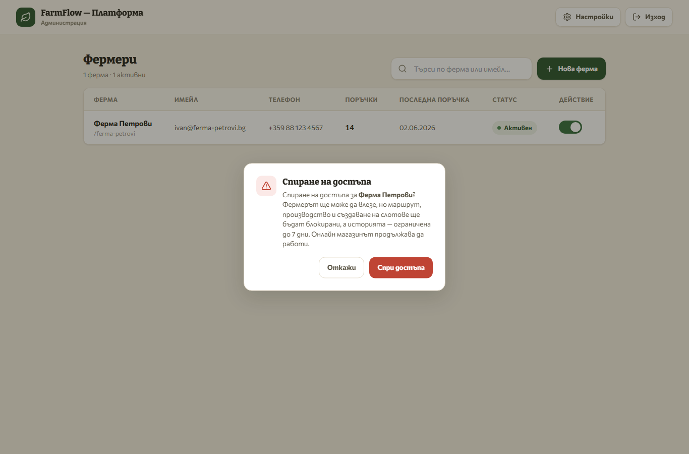

<b>A3. Onboard a new farm ("Нова ферма")</b>

Click **+ Нова ферма** (top-right). Fill:

- **Име на фермата** — the farm name (the public **slug** is derived from this).
- **Имейл** — the owner's login email.
- **Временна парола** — a temporary password. Click **Генерирай** to auto-create a strong one.
- **Телефон** *(optional)*.

Click **Създай**. The farm + its owner login are created instantly.

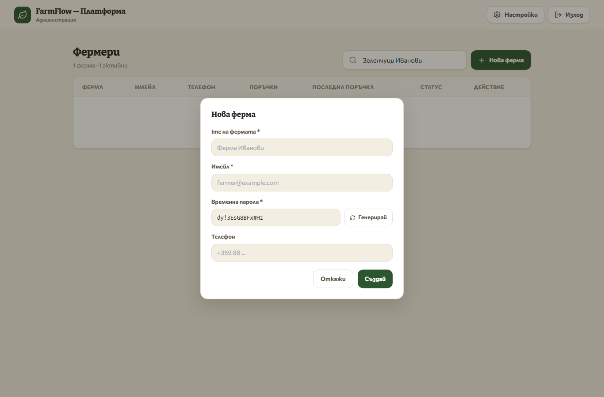

**Hand the email + temporary password to the farmer.** On their first login they are **forced to change it** (see B1). Then point a storefront at their slug → see [adding-a-new-storefront.md](adding-a-new-storefront.md).

<b>A4. Disable / re-enable a farm (manual override)</b>

Flip the farm's **Достъп toggle**. Disabling asks for confirmation ("Спиране на достъпа", screenshot in A2):

- The farmer **can still log in**, but **route, production, slot creation, and newsletter sending are blocked**, and history is limited to 7 days.
- **Their online store keeps working** (customers can still browse/order).

Re-enabling is immediate (no confirmation). This is a **manual override** — billing normally drives the status automatically (A6), but you can suspend or restore any farm by hand.

<b>A6. Billing & premium</b>

Farms are billed automatically through Stripe: **30 € / month** + **2 € per newsletter broadcast** they send. You don't collect anything by hand.

- **План column** — toggle a farm to **Премиум** to make its subscription **free** (no monthly fee, no per-email fee); it stays active forever without a card. Toggle back to **Стандартен** to bill it normally.
- **Status** — driven by Stripe: a successful charge keeps it **Активен**; a failed charge moves it to **Просрочен** with a visible countdown (default **7 days**) and emails the farmer; if still unpaid when the countdown ends, it auto-suspends to **Спрян** (same effect as A4).
- **„Имейл сметки"** page — the per-farm tally of newsletter pushes (now collected automatically via Stripe, not by hand).

**Setup (one-time, to go live):** set `STRIPE_SECRET_KEY`, create the 30 €/mo price (`node server/scripts/create-billing-price.mjs`) → put the id in `STRIPE_BILLING_PRICE_ID`, set `NEXT_PUBLIC_STRIPE_PUBLISHABLE_KEY`, and register a Stripe webhook for `invoice.*`, `customer.subscription.*`, and `checkout.session.completed`. Until then billing is dormant (no charges) and farms run free.

<b>A5. Change your own password</b>

Click **Настройки** in the top bar → enter current + new password → **Смени паролата**.

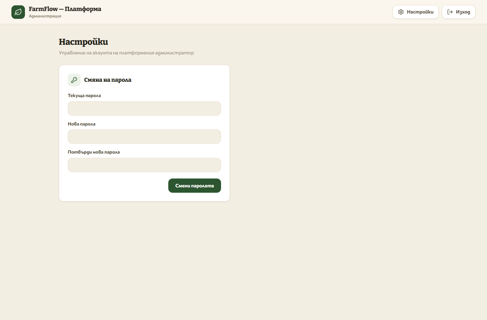

> The new password must differ from the current one. There is no public sign-up — only you create farms.

---

# Part B — Farmer Admin Panel (the farm owner)

The farmer logs in at **http://localhost:3005**.

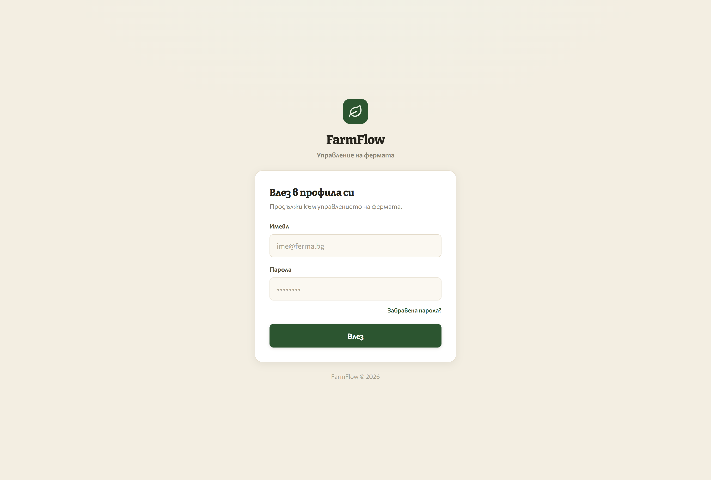

<b>The layout at a glance</b>

Every screen shares the same frame: a **left sidebar** with the farm's logo, the nav, a live **"Сезон активен"** status card, and **Документация / Настройки / Изход** pinned to the bottom; a **top bar** with the current page title (now identical to the sidebar label), a notifications bell, and the farm's avatar. The main area is where the work happens.

The nav is **grouped by what you're doing**, so the everyday work stays at the top and set-up-once screens fold away below:

- **Табло** — pinned on top, always visible (the landing page).
- **Продажби** *(the everyday order pipeline)* — **Поръчки · Производство · Маршрут · Плащания**.
- **Каталог** *(what you sell)* — **Продукти · Фермери · Подкатегории**.
- **Маркетинг** *(storefront content)* — **Статии · Отзиви · Снимки на сайта · Контакти · Имейл клиенти**.
- **Доставка и плащане** *(set once)* — **Методи и цени · Доставка · Часове за доставка · Функции на магазина**.

The **Каталог · Маркетинг · Доставка и плащане** group headers are collapsible (click to fold). Tabs marked **🔒 needs active subscription** are blocked (by the operator via A4, or automatically when a subscription lapses) when the farm is disabled. The **Поръчки** item shows a badge with the count of pending orders.

> A farmer can hide any nav item or whole section they don't use from **Настройки → Странична навигация** (the screen stays reachable by URL); **Табло** can't be hidden.

<b>B1. First login — forced password change (blocking modal)</b>

When you onboarded the farm you set a **temporary** password. On first login a **blocking modal** appears over the panel — it can't be dismissed (no X, no backdrop-close) and the rest of the panel stays locked behind it until a new password is set. (The server also enforces this: the `MustChangePasswordGuard` rejects every write while the temp password is in place, so the lock is real, not just visual.)

The modal **explains why** the change matters: the temporary password travelled by email or by hand, so other people may have seen it — a personal password only the farmer knows protects the orders, customers and farm data.

They enter the temporary password as **Временна парола**, choose a **Нова парола** (≥ 6 chars, must differ), confirm it (an eye toggle reveals what they typed), and click **Запази новата парола**. The modal then flips to a clear **„Готово! Паролата е сменена."** confirmation; **Към таблото** unlocks the panel and drops them on the dashboard.

> They can change their password again anytime from **Настройки → Смяна на парола** — that screen shows an inline green success message instead of redirecting away.

## Продажби — the everyday order pipeline

<b>Табло (Dashboard)</b>

The daily home screen. Four live stat cards sit across the top:

- **Поръчки днес** — orders today, with the +/− delta vs yesterday.
- **Оборот днес** — today's turnover in € (cancelled orders excluded).
- **Чакам потвърждение** — pending confirmations ("всичко чисто" when zero).
- **Следващ слот** — the next delivery slot (booked/capacity + time window).

Below the cards: **Поръчки за днес** (today's order feed — click a row to open the status panel), a **Бързи действия** card with **Потвърди всички чакащи** (confirm every pending order at once) and **Виж маршрута за днес** (jump to Route), and a **Капацитет днес** panel showing each time slot's fill. If the subscription is disabled, a banner appears and history is limited to 7 days.

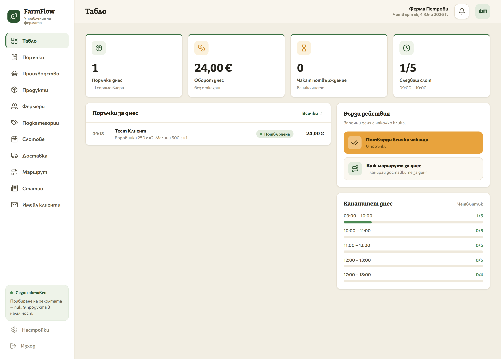

<b>Поръчки (Orders)</b>

The full order list. **Search** by customer name or order ID, and **filter** by status (Всички / Чакащи / Потвърдени / Доставени / Отказани). Columns: time, customer, products, **Доставка** (delivery type), status badge, and total in €.

The **Доставка** column tells you how each order ships at a glance:

- **Адрес** (green pin) — personal/own-slot delivery to the customer's address.
- **Еконт офис** (amber box) — pickup at an Econt office.
- **Еконт адрес** (amber box) — Econt courier to the customer's door.
- **Пазар** — pickup at your location.

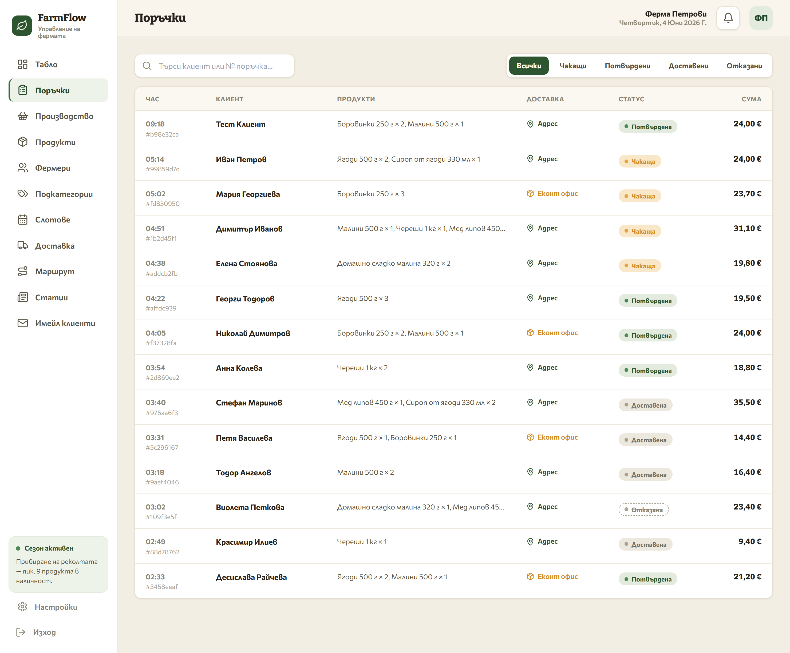

Click any row to open the **order panel** on the right. It shows the full customer block (phone, email, the structured delivery **address** or the chosen **Econt office**), the line items with quantities, the running total, and the status actions — move the order through **pending → confirmed → delivered**, or **cancel** it. A coloured dot shows the payment state (paid / pending / cash-on-delivery). Pending orders also badge the sidebar.

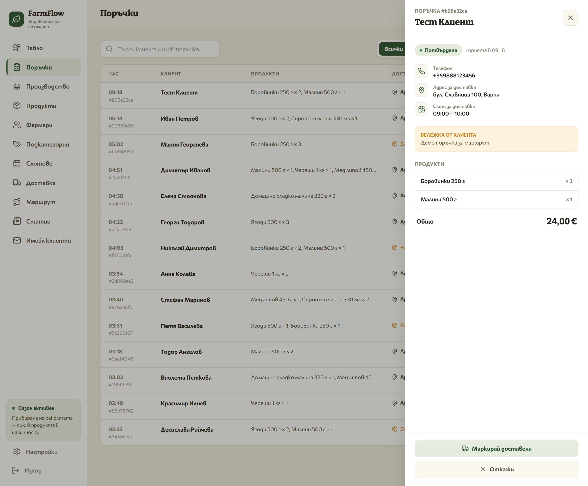

<b>Производство (Production) &nbsp;🔒 needs active subscription</b>

A daily prep/harvest checklist built from the products in **confirmed** orders. Pick a date; the list shows each product, how many orders include it, and the total quantity needed (бр.). Tick rows off as you prepare them — a **Напредък** counter (X/N) and progress bar track completion. The list rebuilds automatically from the day's confirmed orders. (Ticks are a working aid, not saved state.)

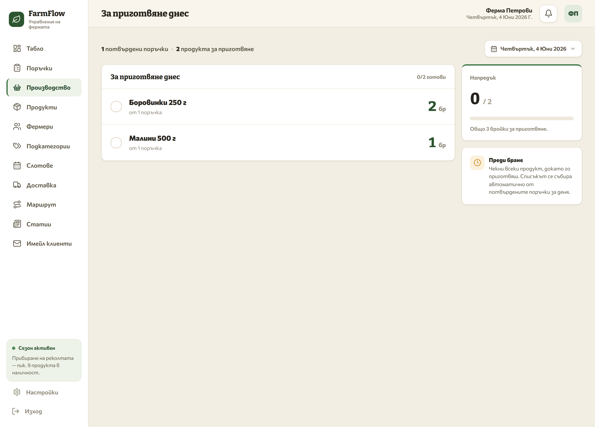

<b>Маршрут (Route) &nbsp;🔒 needs active subscription</b>

The optimised delivery route for a chosen date, built from confirmed home-delivery orders. The summary reads **stops · km · ~minutes**.

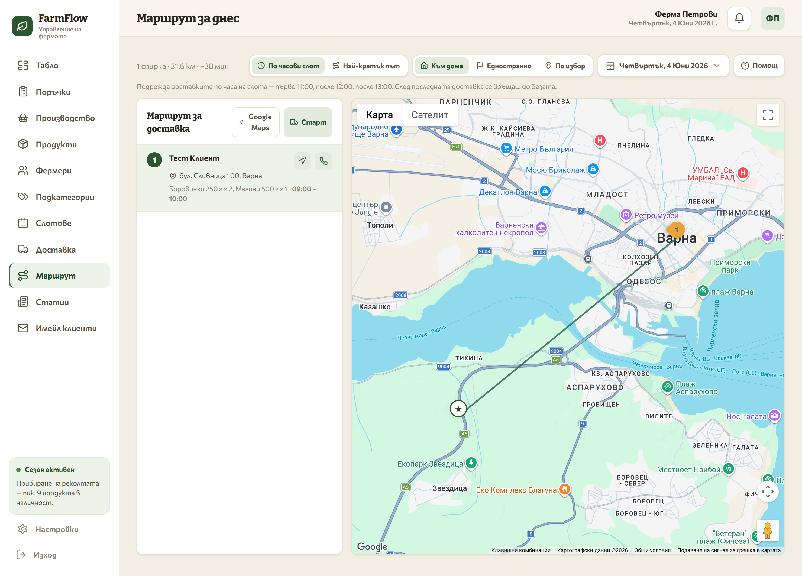

- **Локация** *(set this first)* — a card on this page sets your logistics base: **Адрес на базата (дом)** (your depot/start address, saved as a point on the map and used as the **origin** for every route) and the default **Край на маршрута** — **Към дома** (back to base), **Едностранно** (stop at the last delivery) or **По избор** (a custom end address). **Запази локацията** stores it. *(This moved here from Настройки.)*
- **Order mode** — **По часови слот** (group by booked slot time) or **Най-кратък път** (re-order stops by geography to minimise km).
- The **stop list** numbers each delivery with customer, address, and item summary, plus per-stop **Карти** (open that stop in Google Maps) and **Обади** (call) buttons.
- **Google Maps** opens the whole route and **Старт** launches turn-by-turn navigation. Long routes are split into ≤ 9-waypoint **legs** (Google's limit), each leg chaining into the next.
- The right panel is an interactive map of every stop and the start/end points. (Empty when there are no confirmed home-delivery orders for the day.)

<b>Плащания (Payments & subscription)</b>

Two things live here:

**Абонамент (subscription)** — the farm's plan for using FarmFlow:

- **Стандартен** — **30 € / месец** + **2 € на изпратен бюлетин**, billed automatically.
- **Add a card** with **Добави карта** (a secure Stripe checkout). After that the card is charged each month; **Управление на плащането** opens the Stripe portal to update the card or see invoices.
- A status badge shows **Активен**, **Просрочен** (a payment failed — a countdown shows how many days before the shop is paused; just update the card), or **Спрян**.
- **Премиум** farms see **„Премиум — безплатно"** and are never charged.
- A green nudge appears on the **Табло** until a card is added.

**Приемане на плащания с карта (storefront orders)** — connect Stripe so customers can pay online; the money goes straight to the farm's bank account. **FarmFlow takes 0 % of orders** — the farm keeps everything (minus Stripe's own processing fee).

Connecting is via a **Standard** Stripe account — the farmer signs Stripe's terms directly, gets their own full Stripe Dashboard, and bears all liability (refunds, disputes, negative balance); the platform carries none of it. The Плащания page is a **native FarmFlow dashboard** (status, balance, next payout, recent payments) with an **„Отвори Stripe"** button to the farmer's own dashboard for refunds/disputes.

**Connect guide (shown in-app on the CTA + under Документация → „Как да свържа Stripe"):**

1. Have ready: **лична карта, IBAN, телефон, имейл** (~5 min).
2. **Плащания → „Свържи Stripe"** opens Stripe's secure hosted onboarding.
3. Choose **физическо лице / фирма**, fill name + address + date of birth.
4. Add the **IBAN** Stripe will pay out to; sometimes Stripe asks for an ID photo.
5. Return to the panel — status flips to **„Свързано"** and card checkout goes live.
6. Payouts land automatically (typically 2–7 days); refunds/disputes are handled in the farmer's own Stripe via **„Отвори Stripe"**.

> The card-payment method is switched on/off for the storefront from **Методи и цени** (the **„Карта (онлайн)"** toggle); this page is where the underlying Stripe account is connected and monitored. Both are dormant until the operator configures Stripe (A6) — with no Stripe keys the page shows a "not activated" state and nothing is charged.

## Каталог — what you sell

<b>Продукти (Products)</b>

The catalog — the core of day-to-day work. The toolbar shows "X active · Y total", **+ Добави продукт**, **Подреди** (reorder mode), and **Обяснения**. Each card carries the product image, name, weight/category, an **active** toggle (controls whether it shows on the storefront), the price, a stock-status dot, a **star** (Product of the Week), a cover-framing icon, and two actions: **Редактирай** (quick inline edit) and **Снимки** (full editor with the photo gallery).

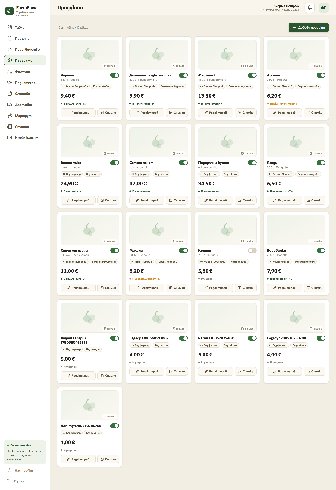

**Quick edit (Редактирай)** flips a card into an inline form for the two things that change most often — **Цена (€)** and **Наличност (бр.)** — with **Запази / Отказ** and a delete button right there.

**+ Добави продукт** opens the **Нов продукт** dialog:

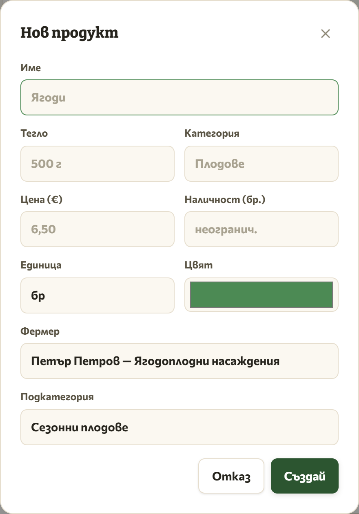

Fields: **Име** (required), **Тегло**, **Категория** (a dropdown of your existing subcategories when sections are on — no more free-text), **Цена (€)** (required), **Наличност (бр.)** (empty = unlimited), **Единица** (бр./кг…), **Цвят** (accent colour), and — when the matching toggles are on — **Фермер** (link a producer). You can now also **add photos right in the create dialog** (a **Снимки** gallery — pick several, photo 0 is the cover); they upload the moment the product is created. Click **Създай**.

**Снимки** opens the full **Редакция на продукт** dialog, which adds the **multi-photo gallery** and **cover framing**:

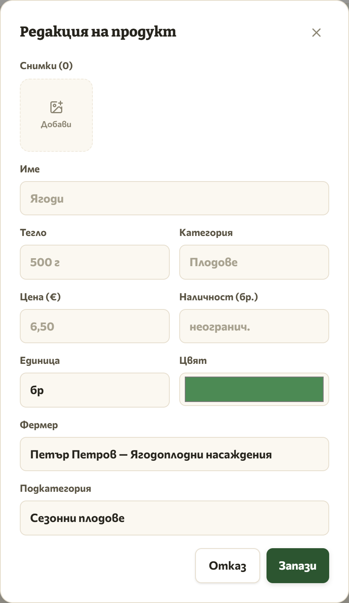

- **Снимки (N)** — add as many photos as you like via the **Добави** tile (drag-drop or file picker). Each upload lands in the product's own folder on Cloudflare R2.
- **Reorder** photos by dragging or the ↑/↓ buttons; **photo 0 is the cover** (or press **Направи корица** on any photo) and is auto-synced to the product card and storefront.
- **Нагласи рамката** — frame the cover: drag the image to pan and use the wheel / slider to zoom, so the right part shows in the shop's card crop (**Центрирай** resets). The same gallery + framing power Farmers and Subcategories.

**Подреди (reorder).** Toggles the list into reorder mode (**Подреди** → **Готово**): drag a card or use the ↑↓ arrows to set the order products appear in the shop. The dropdown picks the scope — **Всички (глобален ред)** or a single subcategory (each scope keeps its own order). The new order is saved once when you press **Готово**, and applies to both storefronts.

**Продукт на седмицата.** A panel above the list highlights one product on a prominent spot in the shop. Turn it on, choose **Ръчен избор** (press the **star** on a product card) or **Автоматично (всяка седмица)** (auto-rotate), pick the placement (**Голяма секция (под заглавието)** or **Лента в хедъра (тънка, най-горе)**), optionally add a short note, and **Запази**. The card star only appears in manual mode.

> **Delete is a soft-delete:** the product is hidden and its name stays reserved per farm. To bring it back, re-activate it rather than creating a duplicate with the same name.

<b>Фермери (Farmers)</b>

The producers shown on the storefront. Turned on from **Функции на магазина → Фермери** (multi-producer mode) — when on, each product can be tied to a specific farmer and the producer's name appears on products in the shop. You get **+ Добави фермер**, **Подреди** (reorder), and a grid of farmer cards (avatar with colour tint, name, role, since-year, phone, bio, and the count of **свързани продукти**). The pencil opens a panel to edit name/role/bio/colour, manage the farmer's **photo gallery** and **cover framing** (same managers as products), and link products.

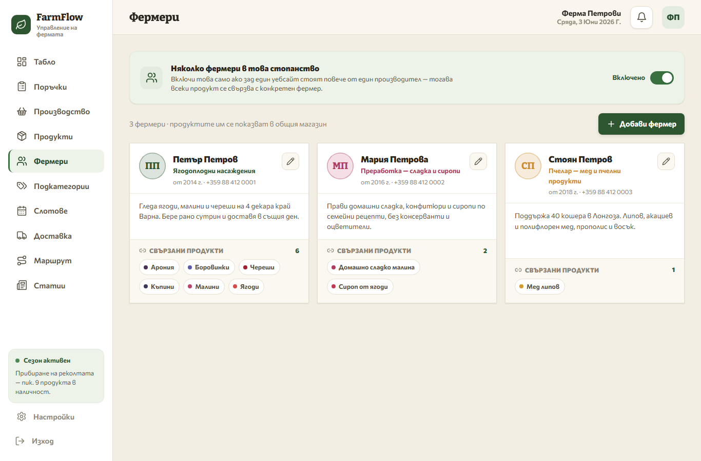

<b>Подкатегории (Subcategories)</b>

Visual sections that group products in the shop. Turned on from **Функции на магазина → Подкатегории**. With it on: **+ Добави подкатегория**, **Подреди** (reorder), and a grid of section cards (hero photo, colour dot, name, description, and **свързани продукти** count). Each becomes a section in the customer-facing catalog. The pencil edits name/description/colour, the section's **photo gallery** and **cover framing**, and bulk-links products.

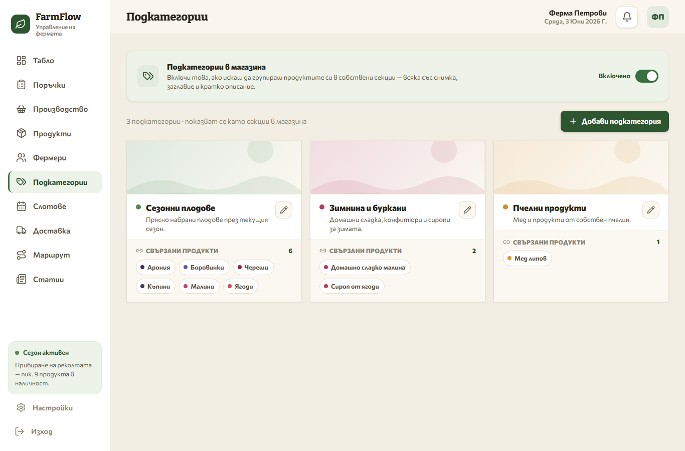

## Маркетинг — storefront content

<b>Статии (Articles) &nbsp;🔒 creating & editing needs active subscription</b>

Blog/news posts for the public storefront. The header shows "X published · Y total"; **Нова статия** creates a draft. Each card has a cover thumbnail, title, a status badge — **Чернова** (draft, hidden) or **Публикувана** (published, live) — and an excerpt. Click a card to open the editor; the trash icon deletes it (with confirmation).

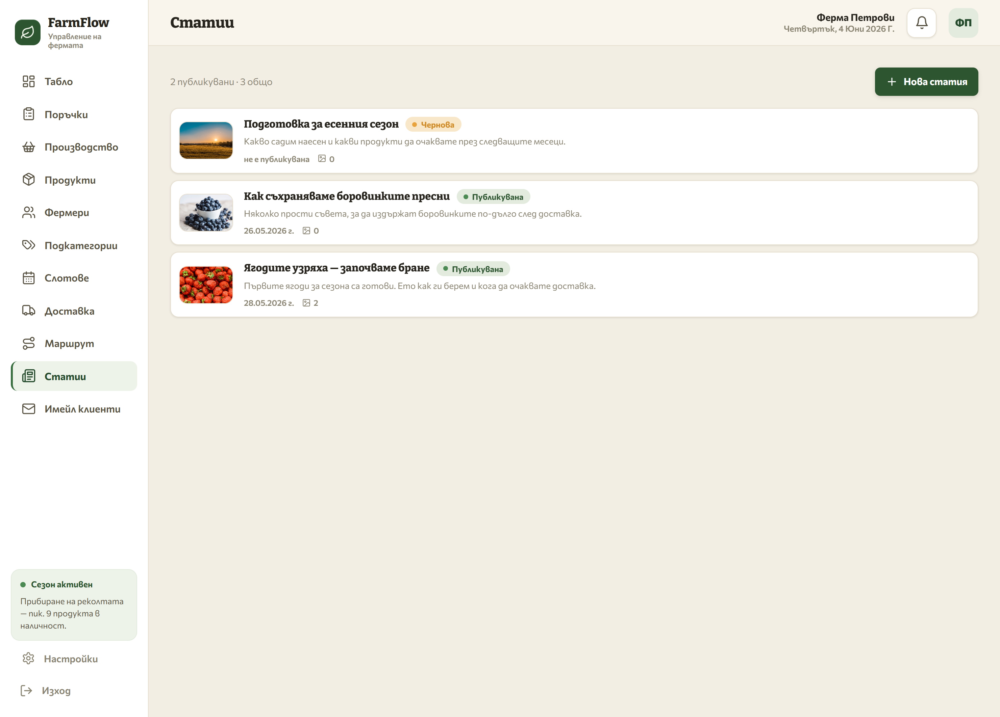

The **editor** (`/articles/{id}`) has a **Редактор / Преглед** tab pair, a **Чернова ⇄ Публикувана** publish toggle, and **Запази**:

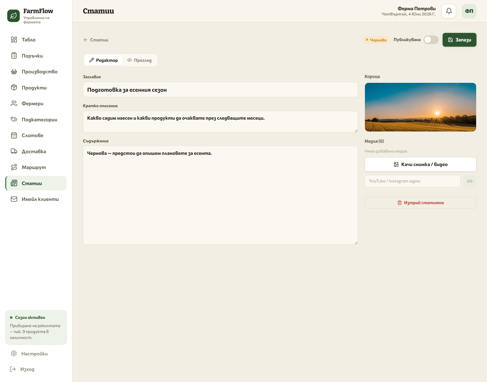

- **Заглавие**, **Кратко описание**, and the **Съдържание** body.
- **Корица** — the cover image (upload / drag-drop).
- **Медия** — rich-media blocks inside the article: **Качи снимка / видео** (image or MP4 to R2) and a **YouTube / Instagram адрес** field that embeds by URL. Blocks can be reordered, captioned, and deleted.
- **Преглед** renders the post exactly as the storefront will show it.

> The whole Статии section can be hidden from the shop with **Функции на магазина → Статии**.

<b>Отзиви (Reviews)</b>

Customer ratings and testimonials, which you moderate before they go live. (Enable customer reviews on the storefront with **Функции на магазина → Отзиви**.)

The screen has three tabs: **Чакащи** (new, with a count badge), **Публикувани** (live in the shop) and **Скрити**. Each review card shows a 1–5 **star** rating, the author's name and location, the review text, and the date. Per review:

- **Публикувай** — the review goes live in the shop.
- **Скрий** — it disappears from the shop without being deleted.

A new review never appears automatically — it waits in **Чакащи** for your approval. You can flip a review between published and hidden at any time. (Empty states: „Няма чакащи отзиви." etc.)

> To **feature specific reviews on the homepage**, pick them in **Настройки → Начална страница → Отзиви** (up to 12 of your published reviews).

<b>Снимки на сайта (Site photos)</b>

The decorative photos for the storefront's fixed spots (hero, section banners…). Each **slot** is a specific place on the public site; an empty slot shows a neutral placeholder — exactly as the site renders it until you add a photo. Slots are grouped by page/section.

Per slot:

- **Качи снимка** (or **Смени** when filled) — upload an image (**JPEG, PNG, WebP**); each slot shows its expected aspect (e.g. „Формат 16:9").
- **Премахни снимката** — clears it back to the neutral placeholder.

Changes go **live immediately** after upload — there's no extra Save. (Empty catalog: „Няма декоративни места за този сайт.")

<b>Контакти (Contacts)</b>

The contact and branding info customers see in the storefront footer and contact page. One screen, several blocks, with a sticky **Запази** at the bottom:

- **Информация за контакт** — **Адрес / място на пазара**, **Работно време**, **Кратко описание (във футъра)** (a short tagline) and **Имейл за контакт**. Free text — write them as customers should read them.
- **Социални мрежи** — **Добави** up to 8 links, each a **label** + **URL** (must start with `https://`; the icon is recognised from the address — Facebook, Instagram, TikTok, YouTube — others get a generic icon).
- **Локация на картата** — click the map to drop the pin, or type **Ширина (lat)** / **Дължина (lng)** by hand. It shows on the storefront.
- **Иконка на сайта** (favicon) — **Качи икона** (**PNG or ICO, up to 512 KB**); appears in the browser tab. **Премахни** clears it.
- **Основен цвят (theme color)** — a colour picker + hex field that tints the storefront; **Изчисти** reverts to the default green.

<b>Маркетинг и проследяване (Marketing &amp; tracking)</b>

Connect the storefront to Google and Meta for ads + analytics **without a developer**. The farmer pastes their per-vendor **IDs** once; the storefront templates the loader snippets and injects them. No vendor code is stored — only the IDs. An empty field disables that vendor; a malformed value is rejected (a soft warning shows) so a typo can never emit a broken script.

- **Google Analytics (GA4)** — **Measurement ID** (`G-…`), for traffic + behaviour.
- **Google Ads** — **Conversion ID** (`AW-…`) plus a **Conversion Label** so a completed order is reported as a purchase conversion (the base tag alone can't attribute a sale; a lone label is ignored).
- **Meta Pixel** — the numeric **Pixel ID** from Events Manager, for Facebook/Instagram ads.
- **По избор (optional)** — **Google Tag Manager** container (`GTM-…`) and **TikTok Pixel**, only if already in use.

GDPR: the storefront shows a **cookie-consent bar** — Google loads in **Consent Mode v2** (defaulted to *denied*/modeled) and Meta with consent **revoked** until the visitor accepts; TikTok is deferred until consent. On the order-confirmation page a **purchase** event fires for GA4 + Google Ads + Meta (value in €), so sales are attributed automatically. Saved per farm via `settings.marketing`; changes go live on the next storefront render.

<b>Имейл клиенти (Newsletter broadcasts)</b>

Reach the customers who subscribed to the farm's newsletter. The header shows the **active subscriber** count; the **Абонати** list shows each email and signup date.

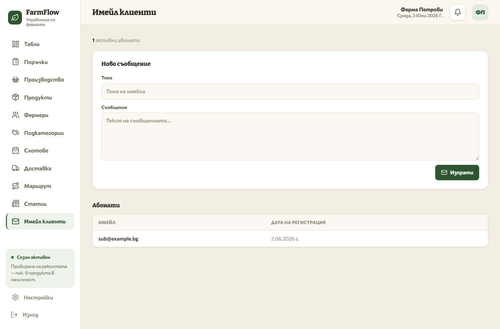

**Ново съобщение** composes a broadcast: a **Тема** (subject) and **Съобщение** (body), then **Изпрати**. A confirmation step shows the recipient count before anything goes out, and a toast reports how many emails were sent. (Empty state: "Все още няма абонати.") **Each broadcast costs 2 €**, added to the farm's monthly subscription bill — unless the farm is **Премиум** (free). Sending is blocked while the subscription is suspended.

## Доставка и плащане — set once

<b>Методи и цени (the delivery + payment switchboard)</b>

The quick on/off screen — decide in one place **how customers pay and receive** their orders. Each method is a toggle; turn on as many as you like and the customer picks at checkout. Detailed settings live one click away on **Доставка**.

**Плащане:**

- **Наложен платеж** — cash on delivery (the customer pays the courier/at pickup). Works immediately, no extra setup.
- **Карта (онлайн)** — online card payment via Stripe. Shows the connection state (`Активно` / `Не е свързано` / `не е налично`) with a **Свържи** / **Управлявай** link to **Плащания**.

**Доставка:**

- **Вземане от място** — the customer collects in person (no fee). „Настрой адрес и работно време" → Контакти/Доставка.
- **Лична доставка + слотове** — you deliver yourself on booked time slots. „Управлявай слотовете" → **Часове за доставка**.
- **Доставка до адрес с куриер** — Econt courier (to office or door). „Настрой Еконт (ръчно / онлайн)" → **Доставка**.

<b>Доставка (delivery details + Еконт courier)</b>

The detailed configuration behind the switchboard — pricing, schedule, and the Econt integration. *(Methods are turned on/off on **Методи и цени**; here you set the particulars.)* Sticky **Save / Discard** buttons appear on any unsaved change.

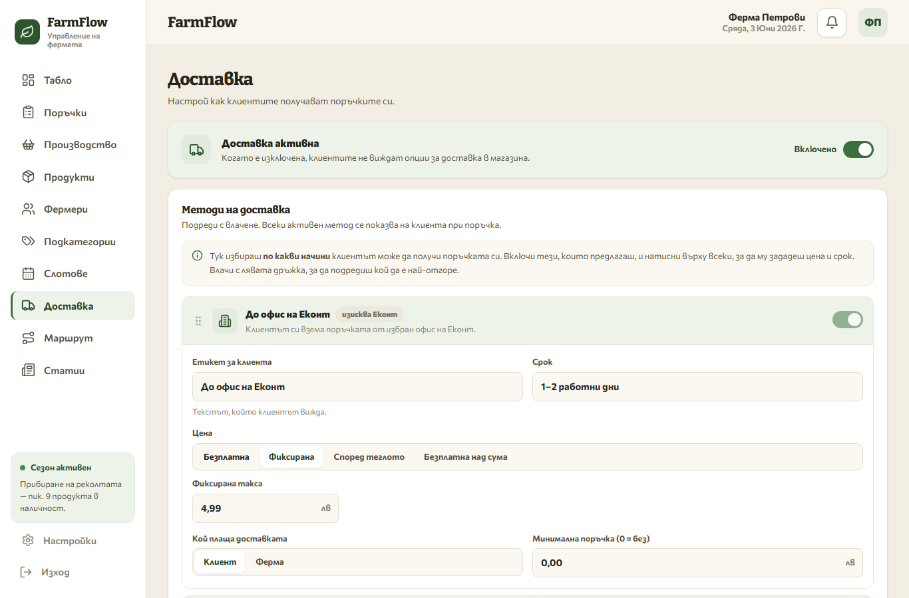

**Настройки на методите.** For each enabled method: a customer-facing **Етикет**, a **Срок** (ETA, e.g. „1–2 работни дни"), and a pricing rule — **Безплатна** or **Фиксирана** (a flat fee) — plus, where relevant, a minimum-order value and **кой плаща** the COD fee (**Клиент** / **Ферма**). A global **Безплатна доставка над сума** field makes delivery free over a chosen order total.

**Еконт (куриерска доставка).** Choose how you ship:

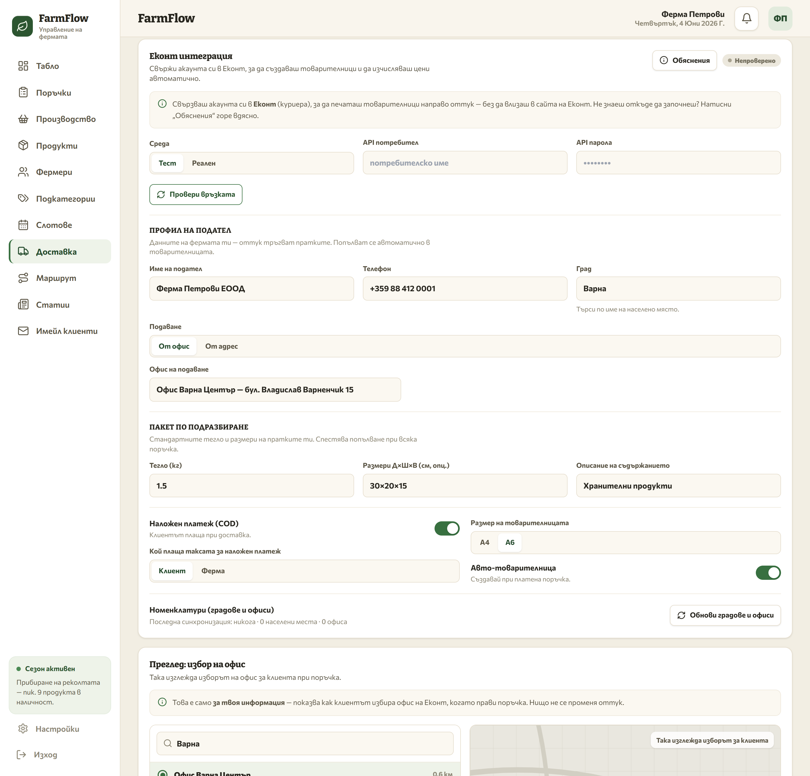

- **Ръчно** — no Econt account needed; you take orders to your own Econt office and send to the customer's address yourself.
- **Автоматично** — the system creates waybills for you. This block then collects:
  - **Account** — **Потребител за Еконт**, **Парола за Еконт** (stored encrypted, shown as „••••• (запазена)" with **Смени**), **Вид акаунт** (**Реален** / **Тест**), and **Провери връзката** which validates live and shows a status badge (**Свързано** / **Непроверено** / **Грешка**).
  - **Профил на подател (фермата)** — **Име на подател**, **Телефон**, **Град** (live Econt autocomplete), and **Подаване** **От офис** (with an office picker) or **От адрес**.
  - **Пакет и плащане** — **Тегло по подразбиране (кг)**, **Описание на съдържанието**, and a **Наложен платеж** toggle with **Таксата плаща: Клиент / Ферма**.
  - **Разширени настройки** — optional **Размери Д×Ш×В**, **Размер на товарителницата** (**A4** / **A6 (етикет)**), and **Авто-товарителница** (auto-create the waybill on a paid order).
  - **Градове и офиси** — last sync date + counts, with **Обнови градове и офиси** to refresh from Econt.
- **Пратки** — a table of orders that already have Econt waybills (tracking number, method, status, history), with actions to refresh or void a label.

<b>Часове за доставка (delivery slots) &nbsp;🔒 creating needs active subscription</b>

Your **own** delivery time slots for the week; customers pick a free one at checkout. (The master **Доставка** on/off lives on **Доставка**; for courier delivery use Econt there. For courier-only shops you can ignore this screen.)

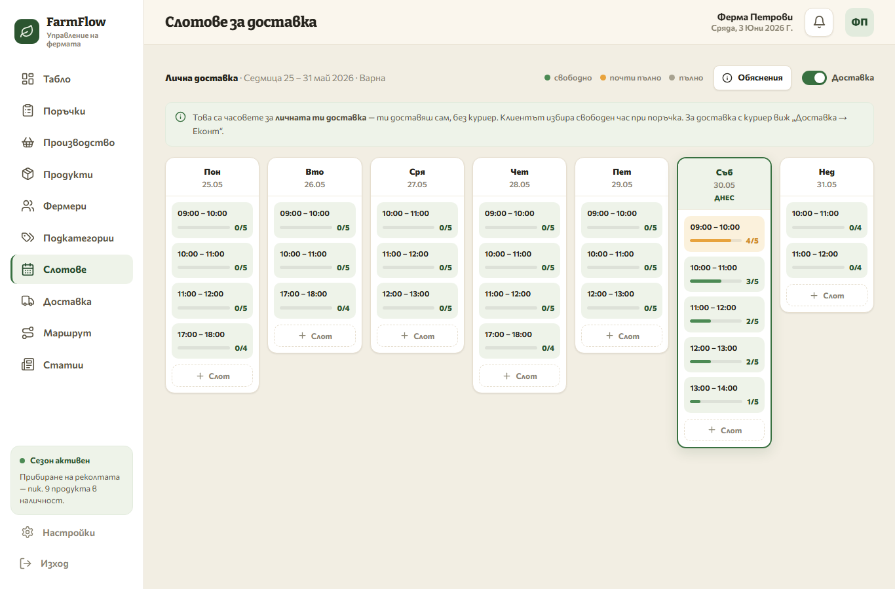

- **Повтарящи се слотове** — set the schedule once and it rolls forward automatically. Choose **По дни от седмицата** (pick the weekdays you deliver) or **През N дни**. With **Еднакви часове за всички дни** off, each weekday gets its own hours and capacity.
- **Колко трае една доставка** — split the time window into smaller booking slots (e.g. „1 час"), so the customer picks an exact hour instead of a whole interval. „Без разделяне" keeps the window as one slot.
- The **7-day grid** (today highlighted) lists each day's slots with a capacity bar and "booked/max", colour-coded **свободно** / **почти пълно** (≥ 80 %) / **пълно**.
- **+ Слот** adds a single slot to a day (time range + max orders); click a slot pill to remove it.
- **Промени деня** — close a specific date (a day off) or change just that date's hours; slots that already have orders are kept.

<b>Функции на магазина (Store features)</b>

Turn whole parts of the store on or off — only what's enabled shows to customers (and in the panel nav). Each is a toggle; **Запази** applies immediately.

- **Каталог:**
  - **Фермери** — multi-producer mode: show the producers in the shop and let products link to them. „Управлявай фермерите" → Фермери.
  - **Подкатегории** — group products into visual sections (e.g. „Млечни", „Зеленчуци"). „Управлявай подкатегориите" → Подкатегории.
- **Съдържание:**
  - **Статии** — the blog/news section in the shop.
  - **Отзиви** — let customers leave reviews (you approve them in **Маркетинг → Отзиви**).

<b>Настройки (Settings)</b>

Account and storefront-front-page configuration, in three tabs:

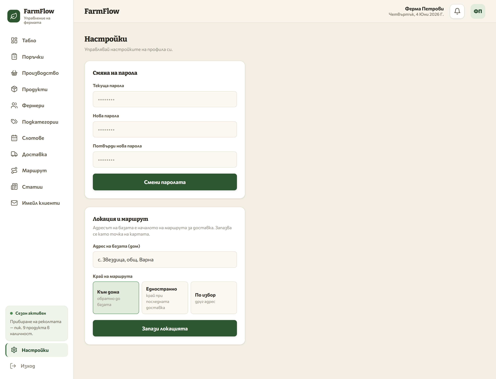

- **Смяна на парола** — change the password anytime: **Текуща парола**, **Нова парола** (≥ 6 chars, must differ), **Потвърди нова парола**, then **Смени паролата**. On success it shows an inline green confirmation (the first-login forced change uses the dedicated modal, B1).
- **Странична навигация** — hide menu items (or whole sections) you don't use, so the sidebar stays short. Hidden screens stay reachable by URL and can be turned back on here; **Табло** is pinned and always visible.
- **Начална страница** — choose which blocks show on the shop's home page and how many items each holds:
  - **Категории** (toggle + **Брой**, 0 = „Всички"), **Фермери** (toggle + count; only in multi-farmer mode) and **Най-актуални** (toggle + count).
  - **Отзиви** — turn on and hand-pick which of your **published** reviews appear on the home page (up to 12).

> The depot address and route end (**Локация и маршрут**) now live on **Маршрут**, not here.

---

<b>How it reaches the public website</b>

Everything a farmer creates here is served to their storefront through the public API
(`/public/<slug>/…`). To connect or add a storefront site, see
**[adding-a-new-storefront.md](adding-a-new-storefront.md)**.

<b>Quick reference</b>

| Action | Where |
| --- | --- |
| Onboard a farm | Super-admin (3002) → **Нова ферма** |
| Disable/enable a farm | Super-admin (3002) → farm **toggle** |
| Super-admin password | Super-admin (3002) → **Настройки** |
| Farmer first-login password | Farmer (3005) → forced **modal** on first login |
| Per-screen in-app help | Farmer (3005) → **„Обяснения"** button (top-right) |
| Full in-app guide | Farmer (3005) → **Документация** (start at „Първи стъпки") |
| Confirm / track orders | Farmer (3005) → **Продажби → Поръчки** |
| Plan the day's route + set depot | Farmer (3005) → **Продажби → Маршрут** (Локация) |
| Connect / monitor card payments | Farmer (3005) → **Продажби → Плащания** |
| Add product + photo gallery | Farmer (3005) → **Каталог → Продукти → Снимки** |
| Reorder / Product of the Week | Farmer (3005) → **Каталог → Продукти** (Подреди / star) |
| Manage farmers / sections | Farmer (3005) → **Каталог → Фермери / Подкатегории** |
| Moderate reviews | Farmer (3005) → **Маркетинг → Отзиви** |
| Storefront photos / contacts / favicon | Farmer (3005) → **Маркетинг → Снимки на сайта / Контакти** |
| Email the subscribers | Farmer (3005) → **Маркетинг → Имейл клиенти** |
| Turn delivery/payment methods on/off | Farmer (3005) → **Доставка и плащане → Методи и цени** |
| Configure courier / Econt | Farmer (3005) → **Доставка и плащане → Доставка** |
| Set own delivery hours | Farmer (3005) → **Доставка и плащане → Часове за доставка** |
| Enable/disable store parts | Farmer (3005) → **Доставка и плащане → Функции на магазина** |
| Home-page blocks + featured reviews | Farmer (3005) → **Настройки → Начална страница** |
| Hide nav items | Farmer (3005) → **Настройки → Странична навигация** |
| API reference | **http://localhost:3000/docs** |

