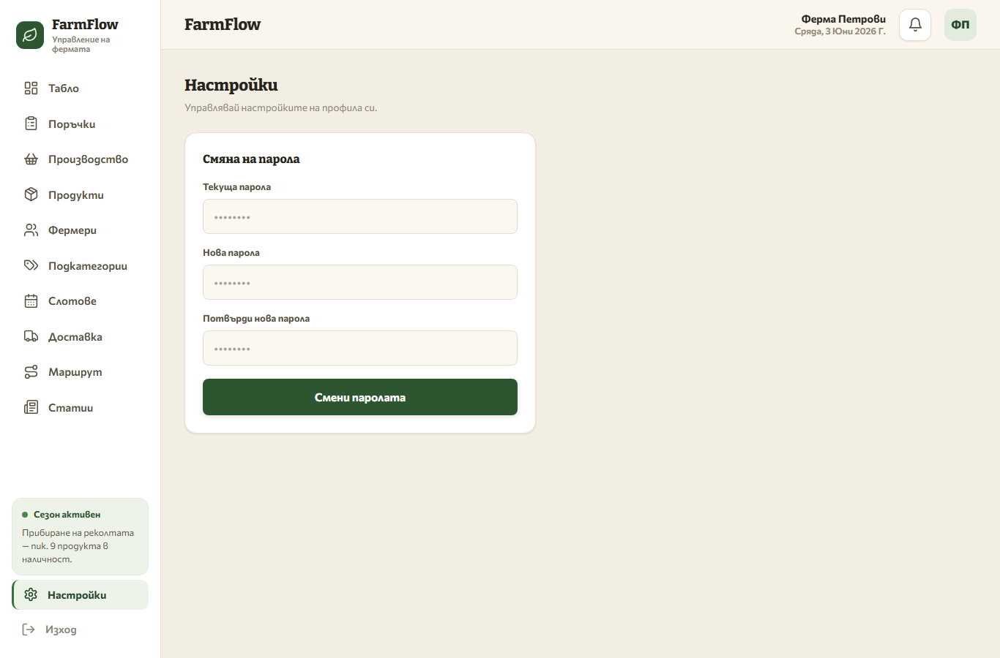

# FarmFlow Admin Panel — User Guide

FarmFlow has **two** panels:

| Panel | Who uses it | URL |
| --- | --- | --- |
| **Super-Admin (Platform)** | You, the operator — onboard farms, disable unpaid ones, change your own password | **http://localhost:3002** |
| **Farmer Admin** | A farm owner — manage their own products, farmers, categories, orders | **http://localhost:3005** |

Both talk to the same API (`http://localhost:3000`, Swagger at `/docs`). Each farm is an isolated **tenant**: a farmer only ever sees and edits **their own** data.

> Demo logins (seed): super-admin `admin@farmflow.bg` / `admin1234`; farm owner `ivan@ferma-petrovi.bg` / `ferma1234`.

---

# Part A — Super-Admin Panel (you, the operator)

### A1. Log in

Open **http://localhost:3002** → sign in with your platform admin email + password ("Вход за администратор").

### A2. The farms list ("Фермери")

You land on the farms table — every farm, its email/phone, order count, last order, **status** (Активен / Спрян), and an enable/disable toggle.

### A3. Onboard a new farm ("Нова ферма")

Click **+ Нова ферма** (top-right). Fill:

- **Име на фермата** — the farm name (the public **slug** is derived from this).
- **Имейл** — the owner's login email.
- **Временна парола** — a temporary password. Click **Генерирай** to auto-create a strong one.
- **Телефон** *(optional)*.

Click **Създай**. The farm + its owner login are created instantly.

**Hand the email + temporary password to the farmer.** On their first login they are **forced to change it** (see B1). Then point a storefront at their slug → see [adding-a-new-storefront.md](adding-a-new-storefront.md).

### A4. Disable / re-enable a farm (e.g. unpaid)

Flip the farm's **toggle** in the Действие column. Disabling asks for confirmation ("Спиране на достъпа", screenshot in A2):

- The farmer **can still log in**, but **route, production, and slot creation are blocked**, and history is limited to 7 days.
- **Their online store keeps working** (customers can still browse/order).

Re-enabling is immediate (no confirmation).

### A5. Change your own password

Click **Настройки** in the top bar → enter current + new password → **Смени паролата**.

> The new password must differ from the current one. There is no public sign-up — only you create farms.

---

# Part B — Farmer Admin Panel (the farm owner)

The farmer logs in at **http://localhost:3005**.

### B1. First login — forced password change

When you onboarded the farm you set a **temporary** password. On first login the farmer is automatically sent to **Настройки** and **cannot use the rest of the panel** until they set a new password.

They enter the temporary password as **Текуща парола**, choose a **Нова парола** (≥ 6 chars, must differ), confirm it, and click **Смени паролата**. After that the whole panel unlocks. They can change their password again anytime from the same **Настройки** page.

After unlocking, the farmer works through the left-sidebar tabs. Below is each tab, top to bottom. Tabs marked **🔒 needs active subscription** are blocked (by you, via A4) when the farm is disabled.

---

### B2. Табло (Dashboard)

The daily home screen. At the top, four live stat cards: **Поръчки днес** (orders today, with the +/− delta vs yesterday), **Оборот днес** (today's turnover, cancelled excluded), **Чакам потвърждение** (pending confirmations), and **Следващ слот** (next delivery slot: booked/capacity + time).

Below: **Поръчки за днес** (today's order feed — click a row to open the status panel), and two quick actions — **Потвърди всички чакащи** (confirm all pending at once) and **Виж маршрута за днес** (jump to Route). A **Капацитет днес** panel shows each time slot's fill. If the subscription is disabled, a banner appears and history is limited to 7 days.

### B3. Поръчки (Orders)

The full order list. **Search** by customer name or order ID, and **filter** by status (all / pending / confirmed / delivered / cancelled). Columns: time, customer, products, delivery type (green **Адрес** = personal address, amber **Еконт** = courier), status badge, and total in лв. Click any row to open the side panel and move the order through its statuses (pending → confirmed → delivered / cancelled). Pending orders also badge the sidebar.

### B4. Производство (Production)  🔒 needs active subscription

A daily prep/harvest checklist built from products in **confirmed** orders. Pick a date; the list shows each product, how many orders include it, and the total quantity needed (бр.). Tick rows off as you prepare them — a progress counter (X/N) tracks completion. (Ticks are a working aid, not saved state.)

### B5. Продукти (Products)

The catalog — the core of day-to-day work. The toolbar shows "X active · Y total" and **+ Добави продукт** (Add product). Each card has the product image (click to upload), name, an **active** toggle (controls whether it shows on the storefront), inline-editable **price** and **stock**, plus **Редактирай** (edit) and **Изтрий** (delete).

**+ Добави продукт** opens the "Нов продукт" dialog:

Fields: **Име** (name, required), **Цена (лв)** (price, required), **Единица** (unit — бр./кг…, required), optional **Тегло** (weight), **Категория**, **Цвят** (accent colour), **Наличност (бр.)** (stock — empty = unlimited), **Фермер** (link a producer — shown on the storefront), and **Подкатегория** (group under a shop section). Click **Създай**.

> **Delete is a soft-delete:** the product is hidden and its name stays reserved per farm. To bring it back, re-activate it rather than creating a duplicate with the same name.

### B6. Фермери (Farmers)

The producers shown on the storefront. A banner toggle, **"Няколко фермери в това стопанство"**, turns on multi-producer mode — when on, each product can be tied to a specific farmer and the farm's name appears on products in the shop. With it on you get **+ Добави фермер** and a grid of farmer cards (avatar with colour tint, name, role, since-year, phone, bio, and linked-product count). **Редактирай** opens a panel to edit name/role/photo/colour and link products.

### B7. Подкатегории (Categories)

Visual sections that group products in the shop. The banner toggle, **"Подкатегории в магазина"**, enables them. With it on: **+ Добави подкатегория** and a grid of section cards (hero photo, colour dot, name, description, product count). Each becomes a section in the customer-facing catalog. **Редактирай** edits name/description/image/colour.

### B8. Слотове (Slots)  🔒 creating needs active subscription

Personal-delivery time slots for the week; customers pick a free slot at checkout. A master **Доставка** toggle turns all slots on/off in the shop. The week shows as a 7-day grid (today highlighted), each day listing its time slots with a capacity bar and "booked/max" — colour-coded **свободно** (free) / **почти пълно** (≥80%) / **пълно** (full). **+ Слот** adds a slot (time range + max orders); click a slot pill to remove it. (These are *your own* deliveries — no courier.)

### B9. Доставка (Delivery)

Delivery configuration. A master **Доставка активна** toggle shows/hides all delivery options in the shop. When on, you configure delivery **methods** (personal delivery and/or **Еконт** courier), schedule windows, optional pricing, and the **Econt** integration (API credentials + office picker, plus a shipments history table). Sticky **Save / Discard** buttons appear on unsaved changes; you must enable at least one method before saving.

### B10. Маршрут (Route)  🔒 needs active subscription

The optimized delivery route for a chosen date, built from confirmed home-delivery orders. The summary shows **stops · km · ~minutes**. The left panel lists each stop (number, customer, address, order count) with **Карти** (open that stop in Google Maps) and **Обади** (call) buttons; **Google Maps** opens the whole route and **Старт** launches navigation. The right panel is an interactive map of all stops. (Empty when there are no confirmed home-delivery orders for the day.)

### B11. Статии (Articles)  🔒 creating & editing needs active subscription

Blog/news posts for the public storefront. The header shows "X published · Y total"; **Нова статия** creates a draft. Each card has a cover thumbnail, title, a status badge — **Чернова** (draft, hidden) or **Публикувана** (published, live) — and an excerpt. Click a card to open the full editor (`/articles/{id}`); the delete icon removes it (with confirmation).

### B12. Настройки (Settings)

Account settings — the password form. Change the password here anytime, as often as wanted: **Текуща парола** (current), **Нова парола** (new, ≥ 6 chars, must differ), **Потвърди нова парола** (confirm), then **Смени паролата**. This is also where a farmer is forced on first login (B1).

---

## How it reaches the public website

Everything a farmer creates here is served to their storefront through the public API
(`/public/<slug>/…`). To connect or add a storefront site, see
**[adding-a-new-storefront.md](adding-a-new-storefront.md)**.

## Quick reference

| Action | Where |
| --- | --- |
| Onboard a farm | Super-admin (3002) → **Нова ферма** |
| Disable/enable a farm | Super-admin (3002) → farm **toggle** |
| Super-admin password | Super-admin (3002) → **Настройки** |
| Farmer first-login password | Farmer (3005) → forced **Настройки** |
| Manage products/farmers/categories | Farmer (3005) → **Продукти / Фермери / Подкатегории** |
| Orders | Farmer (3005) → **Поръчки** |
| API reference | **http://localhost:3000/docs** |
